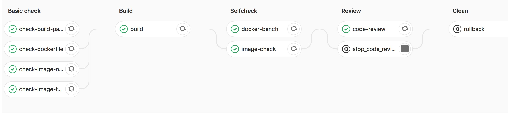

# Docker Builder
[](http://code.example.com/devops/containers)

## Architecture
### Diagram/Description

1. CI Pipeline exists in forked branches.
2. CD pipeline exists in remote master branch. 
3. Review app is used to review merge request. 

### REVIEW APP

1. Topic branch is forked local branch which developer works on.
2. After CI pipeline runs successfully, developer can raise a merge request to remote branch(master). 
3. Ops review dockerfile and changes in this merge, considering merge to master or discard. 

### Gitlab CI Pipeline

#### CI Pipeline


#### Merge Request


#### CD Pipeline 


## Preparation
1. build centos mini from [scratch](https://github.com/CentOS/sig-cloud-instance-images/blob/9a389e11460bd809bb83c5fd4f095dbc8398d8cc/docker/Dockerfile)
2. build your own [dtr](https://docs.docker.com/ee/dtr/admin/install/install-offline/) or [harbor](https://github.com/goharbor/harbor).
3. replace all `dtr.example.com` to `you own dtr/harbor url` in the Dockerfile
4. build your own `http server` to store necessary packages, nginx or apache is recommended.
5. pre-download `yum repo`, `consul`, `consul-template`, `awscli`, `gosu`, `dump-init` packages stores in `step 4 http server`. The specific path you can refer to Dockerfile mentioned part.
6. replace all `repo.example.com` to `you own http server`.
7. build you own [consul](https://www.consul.io/) and [vault]()https://www.vaultproject.io/.

## Build Your Own Image (For Cooperation)
1. Fork this project.
2. Develop and amend in your own `master` branch.
3. Update your env in `makefile.d/config`.
4. Raise a `merge request` to original project.

###### makefile.d/config example: 
    
-  source code branch name
```bash
BUILD_SOURCE_BRANCH=rel
```
-  project version
```bash
BUILD_PROJECT_VERSION=1
```
-  source code revision number
```bash
BUILD_SOURCE_REVISION=0
```        
-  job build number
```bash
BUILD_JOB_NUMBER=0
```        
-  build image name
```bash
# format: deploy_target=os-type-name-version
# e.g: 
deploy_target=centos-buildenv-apm-18
```

## Project Structure VS Build Parameters
###### image version define
```bash
BUILD_SOURCE_BRANCH?=rel # source code branch name
    
BUILD_PROJECT_VERSION?=1 # project version

BUILD_SOURCE_REVISION?=0 # source code revision number

BUILD_JOB_NUMBER?=0      # job build number

```
###### project structure:                                  build parameters:

```yaml
containers:
    - OS:                                           os = (centos/busybox/ubuntu)
        - package type:                             type = (base/buildenv/product/tools)
            - package name:                         name = (base/java/jetty/nginx/node)
                - package version:                  version = (1.8.0/9.2.14)
                    - image version:                image version = (rel.1.0) # define in makefile.d/config
                        - Dockerfile                Dockerfile
```

## Use `Makefile` to Build Images(For Maintainer)
i. command
```bash
make <target> [os=centos] type=base name=node [version=9.2.14] 
```
i. parameters
```yaml
- target(required):
        - build
        - release
        - clean
    - os(optional):
        - centos(default)
        - busybox
        - ubuntu
    - type(required):
        - base
        - buildenv
        - product
        - tools   
    - name(required):
        - base
        - jetty
        - node
    - version(optional):
        - 9.2.14(default is latest version)
```
## Example -- build centos base image
#### Preparation
1. Modify dtr url, dtr auth in Makefile.
2. You should build `docker_lint` first which is in `tools/dockerfile_lint`.
3. You should download `docker bench` image from official and upload to your own dtr.
4. Modify Consul Host in `Makefile` and Consul/Vault Host/Token in `centos/base.base/19/rel.1.0/resource/config/apps/supervisord.hcl`
5. Other information please check `base/base/19/rel.1.0/README.md`
#### build 
```bash
make build os=centos type=base name=base version=19
# this will generate an image named like: dtr.example.com/base/base19:rel.1.0.0 locally
```